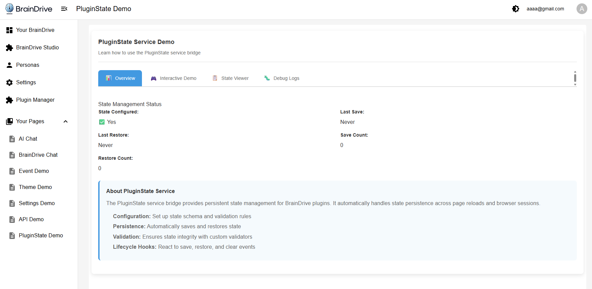

# ServiceExample_PluginState - BrainDrive PluginState Service Bridge Demo

A comprehensive demonstration plugin for BrainDrive's PluginState Service Bridge functionality. This plugin showcases persistent state management within the BrainDrive platform through an interactive tabbed interface that demonstrates state configuration, operations, validation, and error handling.

## 📸 Plugin Demo



*The ServiceExample_PluginState plugin in action, showing the tabbed interface with state management operations, interactive demo controls, and real-time state monitoring.*

## 🎯 Purpose

This plugin serves as a **working demo** of BrainDrive's PluginState Service Bridge, demonstrating:
- How to persist plugin state across page reloads and browser sessions
- State configuration with schemas and validation rules
- Comprehensive error handling for state operations
- Best practices for state management in BrainDrive plugins

## 📦 What's Included

### Four Interactive Tabs

1. **Overview** - State management status and service information
2. **Interactive Demo** - Live controls with auto-save functionality
3. **State Viewer** - Real-time state monitoring and inspection
4. **Debug Logs** - Detailed operation logging for learning

### PluginState Service Bridge Integration
- Complete state configuration with schema validation
- Automatic state persistence and restoration
- Comprehensive error handling and recovery
- Debounced auto-save to prevent excessive operations
- Real-time state monitoring and debugging tools

## 🚀 Installation & Usage

### Prerequisites
- BrainDrive platform (this plugin runs inside BrainDrive)
- Plugin Manager access in BrainDrive

### Installation
1. Install the plugin through BrainDrive's Plugin Manager
2. The plugin will be available in your module library

### Usage in BrainDrive
1. **Create a new page** in BrainDrive
2. **Add the PluginState Demo module** to your page
3. **Explore the features**:
   - Check the Overview tab for service status
   - Use Interactive Demo to test state persistence
   - Monitor real-time state changes in State Viewer
   - Review operation logs in Debug Logs tab

## 🔧 Demo Features

### Overview Tab
- **Service Status**: Real-time connection and configuration status
- **State Statistics**: Save/restore counts and timestamps
- **Service Information**: Educational content about PluginState service
- **Two-column Layout**: Efficient space utilization for status information

### Interactive Demo Tab
- **State Operations**: Manual save, restore, and clear buttons with tooltips
- **Text Input**: Persistent text field with auto-save
- **Counter Control**: Increment/decrement buttons with state persistence
- **Preferences**: Toggle settings for auto-save and debug visibility
- **Auto-save**: Debounced automatic saving (1-second delay after changes)

### State Viewer Tab
- **Live State Display**: Real-time JSON view of current state
- **State Metadata**: Size information and last update timestamps
- **State Information**: Current configuration and auto-save status
- **Formatted Display**: Pretty-printed JSON with syntax highlighting

### Debug Logs Tab
- **Operation Logging**: Step-by-step tracking of all state operations
- **Error Tracking**: Detailed error information with timestamps
- **Log Management**: Clear logs functionality and entry counting
- **Educational Insights**: Learning-focused log messages

## 📡 PluginState Service Bridge Demo

This plugin demonstrates key PluginState Service Bridge concepts:

### Service Configuration
```typescript
// How the PluginState Service Bridge is configured
services.pluginState.configure({
  pluginId: 'ServiceExample_PluginState',
  stateStrategy: 'session',
  preserveKeys: ['demoData', 'saveCount', 'restoreCount'],
  stateSchema: {
    demoData: {
      type: 'object',
      required: false,
      default: { /* default values */ }
    }
  },
  maxStateSize: 10240 // 10KB limit
});
```

### State Operations
```typescript
// Save state with validation
await services.pluginState.saveState(stateData);

// Restore state with error handling
const restoredState = await services.pluginState.getState();

// Clear all saved state
await services.pluginState.clearState();
```

### Lifecycle Hooks
```typescript
// Subscribe to state events
services.pluginState.onSave((state) => {
  console.log('State saved:', state);
});

services.pluginState.onRestore((state) => {
  console.log('State restored:', state);
});

services.pluginState.onClear(() => {
  console.log('State cleared');
});
```

## 🎓 Learning Objectives

After using this demo, developers will understand:
- How BrainDrive's PluginState Service Bridge works
- State configuration patterns with schemas and validation
- Proper error handling for state operations
- Auto-save implementation with debouncing
- State lifecycle management and cleanup
- Best practices for persistent state in BrainDrive plugins

## 🧪 Testing the Demo

### Basic Test Flow
1. Place the PluginState Demo module on a BrainDrive page
2. Navigate to the Interactive Demo tab
3. Enter text in the input field and modify the counter
4. Refresh the page to see state persistence in action
5. Check the State Viewer to monitor real-time changes
6. Review Debug Logs to understand the operation flow

### Advanced Testing
- Test state validation by entering extreme values
- Disable auto-save and use manual save operations
- Clear state and observe the reset to default values
- Monitor error handling by simulating service issues
- Test state size limits with large amounts of data

## 🔍 Technical Implementation

### Enhanced Error Handling
- **Error Categorization**: Service, validation, network, and unknown errors
- **Detailed Error Information**: Type, operation, timestamp, and stack traces
- **Error Recovery**: Graceful handling with user-friendly messages
- **Troubleshooting Tips**: Context-specific help for different error types

### State Validation
```typescript
interface DemoData {
  userInput: string;      // Text input with length validation
  counter: number;        // Numeric value with range validation
  preferences: {
    autoSave: boolean;    // Auto-save toggle
    showDebugInfo: boolean; // Debug visibility toggle
  };
  timestamp: string;      // ISO timestamp for tracking
}
```

### Auto-Save with Debouncing
- **Debounced Updates**: 1-second delay after last change
- **Resource Management**: Proper timeout cleanup
- **User Control**: Toggle auto-save on/off
- **Visual Feedback**: Loading states and operation status

## 🛠️ For Developers

This plugin serves as a **reference implementation** for:
- PluginState Service Bridge integration
- State persistence patterns in BrainDrive
- Comprehensive error handling strategies
- User interface best practices for state management

### Key Files
- `src/PluginStateDemo.tsx` - Main demo component with tabbed interface
- `src/PluginStateDemo.css` - Comprehensive styling with theme support
- `src/types.ts` - TypeScript interfaces and type definitions
- `DEVELOPER_GUIDE.md` - Comprehensive development guide

## 📋 Requirements

- **BrainDrive Platform**: This plugin must run inside BrainDrive
- **PluginState Service**: Requires BrainDrive's PluginState Service to be available
- **Session Storage**: Uses browser session storage for state persistence

## 🆘 Troubleshooting

### Common Issues
- **State not persisting**: Ensure PluginState Service is available in BrainDrive
- **Service initialization errors**: Check that the service bridge is properly configured
- **Validation failures**: Verify data meets schema requirements

### Debug Tips
- Check the Debug Logs tab for detailed operation information
- Use the State Viewer to monitor real-time state changes
- Review browser console for PluginState Service logs
- Verify service configuration matches your data structure

### Error Recovery
- **Service Unavailable**: Plugin waits for service initialization
- **Validation Errors**: Clear error messages with specific guidance
- **Size Limits**: Automatic validation prevents oversized state
- **Network Issues**: Retry mechanisms and graceful degradation

## 🎨 UI Features

### Responsive Design
- **Mobile-friendly**: Adapts to different screen sizes
- **Theme Support**: Light and dark theme compatibility
- **Accessibility**: High contrast mode support
- **Reduced Motion**: Respects user motion preferences

### Interactive Elements
- **Tooltips**: Helpful information on hover
- **Loading States**: Visual feedback during operations
- **Status Indicators**: Real-time service connection status
- **Error Display**: Comprehensive error information with recovery options

## 📚 Related Links

- [BrainDrive](https://github.com/BrainDriveAI/BrainDrive)
- [Service Bridge - PluginState Developers Guide](DEVELOPER_GUIDE.md)

---

**Experience BrainDrive's PluginState Service Bridge in Action! 💾**

*This is a demonstration plugin designed to run within the BrainDrive platform. It showcases comprehensive state management capabilities with best practices for error handling, validation, and user experience.*